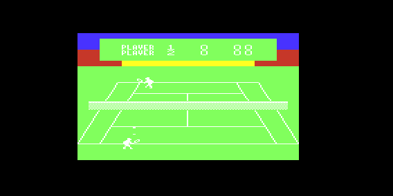

# Baguel

A unexpanded **VIC-20** tennis game (suspended / in hold)

Note: game's far from ready (if ever it will be). You can try it if you want but keep in mind that's simply a little experiment (at least for now)

This game is mostly a way to try to code software sprites - for unexpanded VIC-20. 

And, considering that to avoid flickering it seems that's better (if not needed) to have a sort of "back buffer", with just 3,5 kb there's really little room for a full game (at least not using asm only).

In this project I used a single double shared structure to get the modified screen pos/chars and to add only the needed characters to be mixed (reusing the one in the same position), and a minimal buffer to store those characters while drawing them, so to have a raster sync call to put characters AND added/changed graphic all at once.

I also flip sprite run-time, to minimize original graphic source.

Even this way I almost run out of space EVEN doing a pixel per pixel movement just left-right for human characters (2x2 blocks - so I need potentially 6 chars to draw a horizontal shifted sprite - I'd need 9 each to have a horizontal and vertical shifted sprite)

I guess it should be doable for the extra 3,5 expanded VIC-20. I'll see if try that in the future.

Game coded more or less in **C** using **Oscar64** [https://github.com/drmortalwombat/oscar64].
